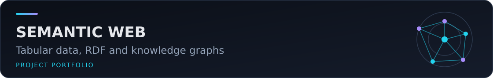

# Automatic Knowledge-Graph Construction from Tabular Data (Semantic Web & XML)



Academic project that converts a small tabular dataset into RDF and enriches the resulting graph with rule-based relations, TF-IDF/cosine-similarity links, inferred memberships, and ontology mappings.

## Project contents

- `src/intelligent_lod_converter.py`: CSV loading, RDF construction with RDFLib, relation discovery, static DBpedia city links, and RDF export.
- `src/comparison_r2rml.py`: fixed-mapping baseline and a comparison report.
- `notebooks/`: cleaned copies of the submitted notebooks; cell outputs and machine-specific metadata were removed.
- `etudiants.csv`: anonymized, synthetic ten-row example. Names and email addresses from the submitted example were replaced.

The source aligns terms with FOAF, Schema.org, AIISO, Dublin Core, and DBpedia resources. 

## Technologies

Python, pandas, NumPy, RDFLib, scikit-learn, RDF/Turtle/N-Triples/XML.

## Installation and use

```bash
python -m venv .venv
# Windows: .venv\Scripts\activate
# Linux/macOS: source .venv/bin/activate
python -m pip install -r requirements.txt
python src/intelligent_lod_converter.py
python src/comparison_r2rml.py
```

Run the commands from the repository root because the academic scripts use relative paths. On a Windows console using a legacy code page, enable UTF-8 before running the scripts because their educational output contains Unicode symbols:

```powershell
$env:PYTHONUTF8 = "1"
```

Generated RDF and text reports are ignored by Git.

## Authors

- Adam El Akkaoui
- Mohammed Zaidouh

The original article acknowledges Prof. A. Ouacha for academic supervision.

## Academic artefacts

- [French academic article (PDF, contact details redacted)](docs/academic-article-fr.pdf)
- [Editable French academic article (DOCX, contact details redacted)](docs/academic-article-fr.docx)


## Results

The project documentation reports the following results on the 10-record tabular example:

| Metric | Classic R2RML approach | Intelligent approach |
|---|---:|---:|
| RDF triples | 90 | **395** |
| Discovered relations | 0 | **54** |
| Ontologies aligned | 0 | **5** |
| Manual mappings | 8 | **0** |
| Execution time | 0.0013 s | 0.0554 s |

The intelligent pipeline combines exact-rule discovery, TF-IDF/cosine similarity, inference and DBpedia links, then aligns the resulting graph with **FOAF, Schema.org, AIISO, DBpedia and Dublin Core**. The project reports a **+338.9% increase in RDF triples** compared with the classic baseline and exports the enriched graph in RDF/XML, Turtle, N3 and N-Triples formats.
